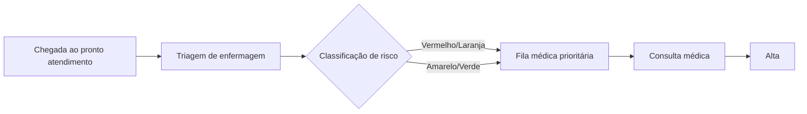
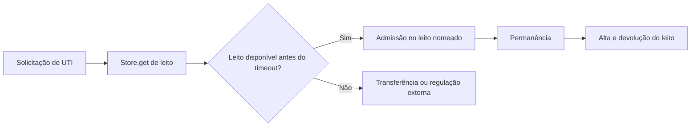
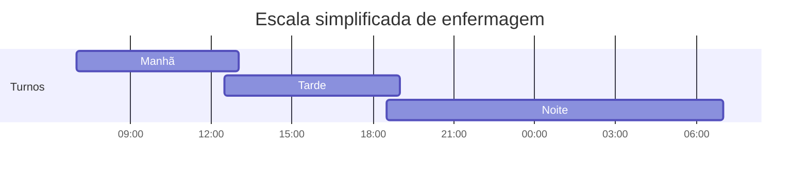
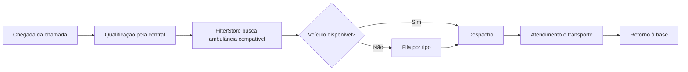

# Documentação didática de SimPy 4.1.1 para simulação hospitalar em Python

## Resumo executivo

A versão estável mais recente de **SimPy** encontrada no **PyPI** é **4.1.1**, publicada em **13 de novembro de 2023**. A documentação estável oficial está congelada em **SimPy 4.1.1** e aponta para a revisão **`22cb5d86`**; a **tag oficial 4.1.1** no repositório do projeto em **GitLab** usa exatamente essa mesma revisão. Já o espelho em **GitHub** existe, mas **não publica GitHub Releases**, de modo que a verificação canônica da release deve ser feita via **PyPI + tag oficial do GitLab + docs estáveis**. citeturn1view0turn15search2turn2search2turn25view3

Para fins de uso prático, a série **4.1** é uma linha de estabilização e modernização de empacotamento/tipagem. As mudanças mais visíveis para quem desenvolve modelos vieram em **4.1.0** — por exemplo, **Python 3.8 como mínimo suportado**, **suporte a Python 3.12** e a propriedade **`Process.name`** — enquanto **4.1.1** refinou tipagem, documentação e tornou **`Event.fail()`** mais estrito ao exigir uma instância de `Exception`. citeturn3view0turn22view0

O SimPy 4.1.1 continua sendo um framework de **simulação de eventos discretos orientada a processos**, com **processos modelados como geradores Python**, ambiente explícito, eventos combináveis, recursos compartilhados, estoques homogêneos (`Container`) e estoques de objetos (`Store`). Ele é apropriado para modelagem operacional hospitalar — filas, leitos, escalas, fluxo de pacientes e despacho — mas **não é uma ferramenta de simulação contínua** nem traz, por padrão, uma camada gráfica/estatística pronta como softwares comerciais. citeturn16view0turn16view1turn10view0turn18search0

Esta documentação foi escrita para **desenvolvedores Python com programação básica**, mas novos em simulação. Os exemplos usam cenários **hospitalares inspirados em rotinas plausíveis de unidades Unimed**, com **parâmetros anonimizado e didáticos**. Páginas públicas da marca descrevem **pronto atendimento com classificação de risco por cores/gravidade** e hospitais com **UTI e leitos**, mas isso **não configura um protocolo único e público de toda a rede**; por isso, os modelos abaixo devem ser lidos como **hipóteses de ensino**, não como espelho operacional de uma unidade específica. citeturn14search0turn14search8turn14search11turn14search14turn14search18

## Verificação da versão e mudanças relevantes

| Fonte | Evidência encontrada | Interpretação técnica |
|---|---|---|
| PyPI | `simpy 4.1.1`, “Latest version”, release em **2023-11-13**, requer **Python >= 3.8**. citeturn1view0 | **Versão-alvo do pacote** para instalação com `pip`. |
| Documentação estável | `SimPy 4.1.1 documentation`, revisão **`22cb5d86`**. citeturn15search2 | **Base documental correta** para leitura da API/alvos de código. |
| GitLab oficial | Tag **4.1.1**, commit **`22cb5d86`**, datada de **2023-11-12**. citeturn2search2 | Confirma o **snapshot oficial do código** usado na documentação estável. |
| GitHub espelho | O repositório `simpx/simpy` existe, é um **fork do GitLab oficial**, e a área de **Releases** informa “**No releases published**”. citeturn25view3turn26view0 | GitHub é útil como espelho/navegação, mas **não é a fonte formal da release**. |

Há uma pequena diferença de data entre **tag no GitLab (12/11/2023)** e **publicação no PyPI (13/11/2023)**. Em prática de release isso é normal: a tag pode ser criada antes do upload do pacote ao índice. Como a revisão das docs estáveis coincide exatamente com a tag oficial, a decisão correta para esta documentação é **fixar todo o material em `simpy==4.1.1`**. citeturn1view0turn15search2turn2search2

Os itens de changelog mais relevantes para quem mantém modelos hospitalares são estes. Em **4.1.1**, o projeto reforçou a tipagem de `EventCallback`, reduziu alguns ruídos de exceção com `raise from None`, passou a fazer `Event.fail()` lançar `TypeError` quando o argumento não é uma `Exception`, e atualizou exemplos/documentação. Em **4.1.0**, a série 4.1 consolidou **Python 3.8+**, adicionou **`Process.name`**, registrou **suporte a Python 3.12** e modernizou o empacotamento baseado em setuptools. Como inferência operacional, isso significa que a API pública mudou pouco no que diz respeito ao estilo de modelagem, mas ficou **mais previsível para ferramentas de checagem estática** e **mais adequada a ambientes Python modernos**. citeturn3view0turn22view0

## Instalação, conceitos centrais e destaques da API

A documentação oficial de instalação do SimPy 4.1.1 afirma que a biblioteca é **pure Python**, **não possui dependências**, roda em **Python 3.8 ou superior** e pode ser instalada com `pip install simpy`. Para prática reprodutível, entretanto, o procedimento mais robusto é criar um **ambiente virtual** e **fixar a versão exata** em `requirements.txt`. O guia de empacotamento Python em pt-BR recomenda justamente usar `venv` + `pip`. citeturn16view4turn32search12turn32search2turn32search13

```bash
# Linux/macOS
python -m venv .venv
source .venv/bin/activate

# Windows PowerShell
# python -m venv .venv
# .venv\Scripts\Activate.ps1

python -m pip install --upgrade pip
python -m pip install "simpy==4.1.1"
python -m pip freeze > requirements.txt
```

Um `requirements.txt` mínimo, suficiente para todos os scripts desta documentação, é:

```txt
simpy==4.1.1
```

Arquivos `requirements.txt` são o formato suportado pelo `pip` para materializar dependências reprodutíveis; `pip freeze` é a forma padrão de gerar esse inventário a partir de um ambiente já preparado. citeturn32search2turn32search13turn32search23

Os conceitos centrais de SimPy 4.1.1 podem ser resumidos desta forma:

| Primitiva | Papel técnico | Uso hospitalar típico | Fonte oficial |
|---|---|---|---|
| `Environment` | Mantém relógio, agenda eventos e executa `run()`, `step()` e `peek()`. | Horizonte diário do pronto atendimento, rodada de plantão, turno de UTI. | citeturn16view2turn5view2 |
| `Process` | Um gerador Python que “vive” no ambiente; ele próprio é um evento e pode retornar valor. | Paciente, ambulância, profissional, internação, rotina de monitoramento. | citeturn16view1turn21view0 |
| `Event` / `Timeout` | Unidade básica de espera/sincronização; eventos podem ter valor, falhar, disparar callbacks e ser combinados com `&` e `|`. | Espera por tempo, timeout de leito, sincronização de recursos, desistência/transferência. | citeturn21view0turn5view1 |
| `Resource` | Limita quantos processos usam um recurso ao mesmo tempo. | Médico, sala, tomógrafo, enfermeiro de triagem. | citeturn10view0turn16view3 |
| `PriorityResource` | Igual a `Resource`, mas ordena a fila por prioridade crescente. | Classificação de risco no pronto atendimento. | citeturn10view0 |
| `PreemptiveResource` | Permite preempção de usuários por solicitações mais prioritárias. | Casos muito específicos: manutenção crítica, plantão técnico, não necessariamente consulta clínica. | citeturn10view0 |
| `Store` / `FilterStore` | Armazenam objetos Python; `Store` é FIFO e `FilterStore` permite filtrar itens. | Leitos nomeados, ambulâncias por tipo, kits cirúrgicos, slots identificáveis. | citeturn10view0 |
| `Container` | Modela quantidade homogênea, contínua ou discreta. | Número de profissionais em plantão, oxigênio, insumos agregados. | citeturn10view0 |
| `start_delayed()` | Inicia um processo depois de um atraso estritamente positivo. | Programar abertura de turno, higienização periódica, rondas. | citeturn16view6 |

Duas observações são especialmente importantes em saúde. A primeira é que **eventos no mesmo instante não são processados “ao mesmo tempo”**: o motor usa uma **heap queue** e desempata por **ID crescente do evento**, o que torna a execução **determinística** se você não introduzir aleatoriedade. A segunda é que `env.run(until=t)` **para quando o relógio alcança `t`, mas não processa eventos agendados exatamente em `t`**; isso afeta relatórios de corte de turno e fechamento de horizonte. citeturn20search0turn5view2

## Padrões de modelagem para saúde e cooperativas hospitalares

Em saúde, a pergunta mais útil não é “qual classe do SimPy eu devo usar?”, mas sim “**qual é a natureza do gargalo**?”. Se o gargalo é **capacidade simultânea**, o padrão natural é `Resource`. Se há **prioridade clínica**, a fila vira `PriorityResource`. Se o problema é “**quem é o slot?**” — por exemplo, **leito UTI-A versus leito UTI-B** — então o padrão correto é `Store`/`FilterStore`, porque você precisa manipular **objetos identificáveis**. Se o problema é “**quantos há disponíveis?**”, sem identidade individual, `Container` é normalmente mais simples e mais fiel. Isso decorre diretamente da arquitetura de recursos, containers e stores do SimPy. citeturn16view3turn10view0

Outro padrão recorrente em hospitais é **espera com deadline clínico-operacional**. Exemplos: paciente aguardando leito por no máximo 6 horas; ambulância aguardando liberação de sala vermelha por no máximo 15 minutos; solicitação de exame que perde sentido clínico após determinado intervalo. Em SimPy, isso se modela elegantemente combinando o evento “desejado” com `env.timeout(...)` via `|` (`AnyOf`) ou `env.any_of(...)`. O guia oficial de eventos mostra exatamente esse raciocínio para espera simultânea de múltiplos eventos. citeturn5view1turn21view0

Monitoramento também merece leitura crítica. O SimPy não impõe um subsistema único de métricas; o guia oficial recomenda combinar listas, callbacks e até monkey-patching de recursos quando necessário. Em modelos hospitalares didáticos, isso é uma vantagem porque mantém o raciocínio transparente. Em estudos de produção, porém, você deve estruturar desde o início **replicações**, **semente aleatória**, **coleta de tempos de espera**, **ocupação**, **N pacientes não atendidos**, **percentis** e **intervalos de confiança**. citeturn18search0turn20search3

A rede Unimed possui páginas públicas que descrevem pronto atendimento, classificação de risco por gravidade e hospitais com UTI/leitos, e ao menos uma unidade menciona uso do **Protocolo de Manchester**. Ainda assim, como não há um protocolo operacional único, público e centralizado para toda a marca, os exemplos a seguir usam **suposições plausíveis**: tempos discretos simples, poucos recursos, zero dados reais de pacientes e parâmetros anônimos. citeturn14search0turn14search8turn14search11turn14search14turn14search18

## Exemplos hospitalares didáticos

Os cinco exemplos abaixo são **executáveis com `simpy==4.1.1`**, usam **entradas determinísticas** para facilitar validação manual e estão comentados **linha a linha** no próprio código. Onde eu digo “Unimed”, leia como **cenário plausível de hospital/cooperativa**, nunca como protocolo oficial publicado de uma unidade específica. citeturn1view0turn14search0turn14search11

**Exemplo de triagem de urgência com classificação de risco**

Este modelo usa `Resource` para a enfermagem de triagem e `PriorityResource` para o médico do pronto atendimento. Em `PriorityResource`, valores menores significam maior prioridade. Isso é apropriado para filas clínicas de risco, nas quais o paciente grave ultrapassa a fila comum, mas **não interrompe** um atendimento já em andamento. citeturn10view0

```python
# Requer: simpy==4.1.1
import simpy  # L01: importa a biblioteca de simulação.
# L02: mapeia cor de risco para prioridade numérica; menor = mais urgente.
PRIORIDADE = {"vermelho": 0, "laranja": 1, "amarelo": 2, "verde": 3}
# L03: pacientes anonimizado com chegada, cor, tempo de triagem e tempo médico.
PACIENTES = [
    ("P001", 0, "amarelo", 3, 12),
    ("P002", 1, "verde", 3, 8),
    ("P003", 2, "vermelho", 2, 20),
    ("P004", 4, "laranja", 3, 10),
    ("P005", 7, "amarelo", 3, 9),
]
# L04: lista para coletar métricas finais.
resultados = []

def paciente(env, nome, chegada, cor, t_triagem, t_medico, triagem, medico):  # L05
    yield env.timeout(chegada)  # L06: agenda chegada do paciente.
    print(f"{env.now:02.0f} min | {nome} chega ({cor})")  # L07

    with triagem.request() as req_triagem:  # L08: entra na fila da triagem.
        yield req_triagem  # L09: espera enfermeiro livre.
        print(f"{env.now:02.0f} min | {nome} inicia triagem")  # L10
        yield env.timeout(t_triagem)  # L11: consome tempo de triagem.
        fim_triagem = env.now  # L12: registra fim da triagem.
        print(f"{env.now:02.0f} min | {nome} termina triagem")  # L13

    with medico.request(priority=PRIORIDADE[cor]) as req_medico:  # L14
        yield req_medico  # L15: espera médico com prioridade clínica.
        inicio_medico = env.now  # L16
        espera_medica = inicio_medico - fim_triagem  # L17: fila após triagem.
        print(
            f"{env.now:02.0f} min | {nome} inicia médico "
            f"(espera médica={espera_medica:02.0f} min)"
        )  # L18
        yield env.timeout(t_medico)  # L19: atendimento clínico.
        print(f"{env.now:02.0f} min | {nome} recebe alta")  # L20
        resultados.append((nome, cor, env.now - chegada, espera_medica))  # L21

env = simpy.Environment()  # L22: cria o relógio e a fila de eventos.
triagem = simpy.Resource(env, capacity=1)  # L23: um posto de triagem.
medico = simpy.PriorityResource(env, capacity=1)  # L24: um médico com fila prioritária.

for dados in PACIENTES:  # L25
    env.process(paciente(env, *dados, triagem, medico))  # L26: cria um processo por paciente.

env.run()  # L27: executa até esgotar eventos.

print("\nResumo final")  # L28
for nome, cor, tempo_total, espera_medica in resultados:  # L29
    print(
        f"{nome} | cor={cor:8s} | tempo total={tempo_total:02.0f} min "
        f"| espera por médico={espera_medica:02.0f} min"
    )  # L30
```

**Fluxo do processo**



**Saída esperada**

```text
00 min | P001 chega (amarelo)
00 min | P001 inicia triagem
01 min | P002 chega (verde)
02 min | P003 chega (vermelho)
03 min | P001 termina triagem
03 min | P001 inicia médico (espera médica=00 min)
03 min | P002 inicia triagem
04 min | P004 chega (laranja)
06 min | P002 termina triagem
06 min | P003 inicia triagem
07 min | P005 chega (amarelo)
08 min | P003 termina triagem
08 min | P004 inicia triagem
11 min | P004 termina triagem
11 min | P005 inicia triagem
14 min | P005 termina triagem
15 min | P001 recebe alta
15 min | P003 inicia médico (espera médica=07 min)
35 min | P003 recebe alta
35 min | P004 inicia médico (espera médica=24 min)
45 min | P004 recebe alta
45 min | P005 inicia médico (espera médica=31 min)
54 min | P005 recebe alta
54 min | P002 inicia médico (espera médica=48 min)
62 min | P002 recebe alta

Resumo final
P001 | cor=amarelo  | tempo total=15 min | espera por médico=00 min
P003 | cor=vermelho | tempo total=33 min | espera por médico=07 min
P004 | cor=laranja  | tempo total=41 min | espera por médico=24 min
P005 | cor=amarelo  | tempo total=47 min | espera por médico=31 min
P002 | cor=verde    | tempo total=61 min | espera por médico=48 min
```

**Desempenho e limitações**

O ganho didático aqui é nítido: a prioridade altera a **ordem de serviço** sem exigir lógica ad hoc, porque a ordenação já está embutida em `PriorityResource`. Em operação real, porém, esse modelo ainda é simplificado: não há reavaliação clínica, exames, abandono, retorno, equipe multiprofissional nem salas múltiplas. Se você quisesse que um caso gravíssimo **interrompesse** um usuário em serviço, teria de migrar para `PreemptiveResource`, que é uma semântica mais agressiva e precisa ser usada com muito cuidado em contexto clínico. citeturn10view0

**Exemplo de alocação de leitos de UTI com timeout de espera**

Este modelo trata cada leito como um **objeto nomeado** (`UTI-A`, `UTI-B`), por isso usa `Store` em vez de `Resource`. A espera por leito é combinada com `timeout` usando o operador `|`, isto é, um `AnyOf`: o processo segue assim que **um dos eventos** ocorre — leito disponível ou prazo limite esgotado. citeturn10view0turn21view0

```python
# Requer: simpy==4.1.1
import simpy  # L01: importa a biblioteca.
# L02: pacientes com chegada, permanência em UTI e espera máxima por leito.
PACIENTES = [
    ("P101", 0, 10, 7),
    ("P102", 1, 12, 6),
    ("P103", 4, 8, 7),
    ("P104", 5, 6, 4),
]

def internacao_uti(env, nome, chegada, permanencia, espera_max, leitos):  # L03
    yield env.timeout(chegada)  # L04: agenda solicitação de leito.
    print(f"{env.now:02.0f} h | {nome} solicita leito de UTI")  # L05

    pedido = leitos.get()  # L06: cria evento de retirada de um leito disponível.
    resultado = yield pedido | env.timeout(espera_max)  # L07: leito OU timeout.

    if pedido in resultado:  # L08: conseguiu leito antes do prazo?
        leito = resultado[pedido]  # L09: recupera o identificador do leito.
        print(f"{env.now:02.0f} h | {nome} ocupa {leito}")  # L10
        yield env.timeout(permanencia)  # L11: permanece internado na UTI.
        print(f"{env.now:02.0f} h | {nome} recebe alta do {leito}")  # L12
        yield leitos.put(leito)  # L13: devolve o leito ao estoque.
    else:
        pedido.cancel()  # L14: evita deixar um pedido pendurado na fila.
        print(f"{env.now:02.0f} h | {nome} não conseguiu leito e é transferido")  # L15

env = simpy.Environment()  # L16
leitos = simpy.Store(env, capacity=2)  # L17: store de objetos-leito.
leitos.items.extend(["UTI-A", "UTI-B"])  # L18: pré-popula os leitos disponíveis.

for dados in PACIENTES:  # L19
    env.process(internacao_uti(env, *dados, leitos))  # L20

env.run()  # L21
```

**Fluxo do processo**



**Saída esperada**

```text
00 h | P101 solicita leito de UTI
00 h | P101 ocupa UTI-A
01 h | P102 solicita leito de UTI
01 h | P102 ocupa UTI-B
04 h | P103 solicita leito de UTI
05 h | P104 solicita leito de UTI
09 h | P104 não conseguiu leito e é transferido
10 h | P101 recebe alta do UTI-A
10 h | P103 ocupa UTI-A
13 h | P102 recebe alta do UTI-B
18 h | P103 recebe alta do UTI-A
```

**Desempenho e limitações**

`Store` é a escolha certa quando “leito” não é apenas capacidade, mas um **objeto identificável**. Documentalmente, `Store` opera em disciplina **FIFO**, enquanto `FilterStore` pode alterar a ordem dependendo do filtro aplicado. Aqui isso é suficiente, mas um hospital real quase sempre precisa de regras extras: sexo, isolamento, especialidade, ventilação, score clínico, contingência de infecção, regulação externa e alta probabilística. citeturn10view0

**Exemplo de fluxo do paciente do cadastro à alta**

Este exemplo encadeia `Resource` para cadastro, consultório e laboratório. A ideia central é mostrar que o fluxo hospitalar raramente é linear: parte dos pacientes exige **retorno ao médico** depois do exame, o que reintroduz trabalho na fila e muda completamente o gargalo do sistema. A base conceitual é o padrão clássico de processo → recurso → timeout → próximo estágio. citeturn16view1turn16view3

```python
# Requer: simpy==4.1.1
import simpy  # L01: importa a biblioteca.
# L02: chegada, tempo de consulta inicial, tempo de laboratório e se exige retorno.
PACIENTES = [
    ("P201", 0, 6, 4, True),
    ("P202", 1, 5, 0, False),
    ("P203", 3, 7, 5, True),
    ("P204", 5, 4, 0, False),
]

def fluxo_paciente(env, nome, chegada, consulta_inicial, lab, retorna, cadastro, medico, laboratorio):  # L03
    yield env.timeout(chegada)  # L04
    inicio = env.now  # L05
    print(f"{env.now:02.0f} min | {nome} chega")  # L06

    with cadastro.request() as req_cad:  # L07
        yield req_cad  # L08
        yield env.timeout(2)  # L09: cadastro padronizado.
        print(f"{env.now:02.0f} min | {nome} conclui cadastro")  # L10

    with medico.request() as req_med:  # L11
        yield req_med  # L12
        yield env.timeout(consulta_inicial)  # L13
        print(f"{env.now:02.0f} min | {nome} conclui consulta inicial")  # L14

    if retorna:  # L15: somente alguns pacientes seguem ao laboratório e retornam.
        with laboratorio.request() as req_lab:  # L16
            yield req_lab  # L17
            yield env.timeout(lab)  # L18
            print(f"{env.now:02.0f} min | {nome} conclui laboratório")  # L19

        with medico.request() as req_retorno:  # L20
            yield req_retorno  # L21
            yield env.timeout(2)  # L22: reavaliação curta.
            print(f"{env.now:02.0f} min | {nome} conclui retorno médico")  # L23

    print(f"{env.now:02.0f} min | {nome} recebe alta | lead time={env.now - inicio:02.0f} min")  # L24

env = simpy.Environment()  # L25
cadastro = simpy.Resource(env, capacity=1)  # L26
medico = simpy.Resource(env, capacity=1)  # L27
laboratorio = simpy.Resource(env, capacity=1)  # L28

for dados in PACIENTES:  # L29
    env.process(fluxo_paciente(env, *dados, cadastro, medico, laboratorio))  # L30

env.run()  # L31
```

**Saída esperada**

```text
00 min | P201 chega
02 min | P201 conclui cadastro
01 min | P202 chega
04 min | P202 conclui cadastro
03 min | P203 chega
05 min | P204 chega
08 min | P201 conclui consulta inicial
12 min | P201 conclui laboratório
13 min | P202 conclui consulta inicial
13 min | P202 recebe alta | lead time=12 min
20 min | P203 conclui consulta inicial
24 min | P204 conclui consulta inicial
24 min | P204 recebe alta | lead time=19 min
26 min | P201 conclui retorno médico
26 min | P201 recebe alta | lead time=26 min
25 min | P203 conclui laboratório
28 min | P203 conclui retorno médico
28 min | P203 recebe alta | lead time=25 min
```

**Desempenho e limitações**

A leitura analítica mais importante é esta: o gargalo não está apenas no laboratório, mas no **retorno ao consultório**, que cria **retrabalho** e estende o lead time dos pacientes de exame. Isso é um padrão muito recorrente em ambulatórios, pronto atendimento e hospital-dia. O modelo ainda é mínimo: não há no-show, priorização, múltiplos especialidades nem distribuição estocástica de tempos. Em estudos reais, a primeira extensão recomendada é separar **consulta inicial**, **retorno**, **exame** e **laudo** em fluxos probabilísticos calibrados. 

**Exemplo de escala de enfermagem com `Container` e início retardado de turnos**

Para escalas, `Container` é muito útil quando o que interessa é a **quantidade de profissionais disponíveis**, não a identidade de cada um. O helper `start_delayed()` inicia processos futuramente, mas a documentação deixa claro que o atraso deve ser **estritamente positivo**; por isso o turno inicial começa com `env.process(...)`, e os demais são disparados com atraso. citeturn10view0turn16view6

```python
# Requer: simpy==4.1.1
import simpy  # L01
from simpy.util import start_delayed  # L02: helper oficial para iniciar processos no futuro.

BASE_HORA = 7  # L03: a simulação começa às 07:00.

def relogio(t):  # L04: converte tempo simulado em string HH:MM.
    h = int(BASE_HORA + t) % 24  # L05
    m = int(round((t - int(t)) * 60))  # L06
    return f"{h:02d}:{m:02d}"  # L07

def turno(env, equipe, nome, qtd, duracao):  # L08
    print(f"{relogio(env.now)} | entra turno {nome} (+{qtd})")  # L09
    yield equipe.put(qtd)  # L10: adiciona profissionais disponíveis.
    print(f"{relogio(env.now)} | disponíveis={equipe.level:.0f}")  # L11
    yield env.timeout(duracao)  # L12
    yield equipe.get(qtd)  # L13: retira profissionais ao fim do turno.
    print(f"{relogio(env.now)} | sai turno {nome} (-{qtd}) | disponíveis={equipe.level:.0f}")  # L14

def tarefa(env, equipe, nome, inicio, duracao, qtd):  # L15
    yield env.timeout(inicio)  # L16
    yield equipe.get(qtd)  # L17: consome profissionais da tarefa.
    print(f"{relogio(env.now)} | inicia {nome} (-{qtd}) | disponíveis={equipe.level:.0f}")  # L18
    yield env.timeout(duracao)  # L19
    yield equipe.put(qtd)  # L20: devolve profissionais ao pool.
    print(f"{relogio(env.now)} | termina {nome} (+{qtd}) | disponíveis={equipe.level:.0f}")  # L21

env = simpy.Environment()  # L22
equipe = simpy.Container(env, capacity=20, init=0)  # L23: disponibilidade agregada.

env.process(turno(env, equipe, "MANHA", 6, 6.0))  # L24: 07:00–13:00.
start_delayed(env, turno(env, equipe, "TARDE", 5, 6.5), 5.5)  # L25: 12:30–19:00.
start_delayed(env, turno(env, equipe, "NOITE", 4, 12.5), 11.5)  # L26: 18:30–07:00.

start_delayed(env, tarefa(env, equipe, "MEDICACAO_MATINAL", 0, 1.0, 2), 1.0)  # L27: 08:00–09:00.
start_delayed(env, tarefa(env, equipe, "PICO_ADMISSOES", 0, 2.0, 3), 5.0)  # L28: 12:00–14:00.
start_delayed(env, tarefa(env, equipe, "MEDICACAO_NOITE", 0, 1.0, 2), 13.0)  # L29: 20:00–21:00.

env.run(until=24)  # L30: roda um ciclo completo de 24 horas.
```

**Escala em formato Gantt**



**Saída esperada**

```text
07:00 | entra turno MANHA (+6)
07:00 | disponíveis=6
08:00 | inicia MEDICACAO_MATINAL (-2) | disponíveis=4
09:00 | termina MEDICACAO_MATINAL (+2) | disponíveis=6
12:00 | inicia PICO_ADMISSOES (-3) | disponíveis=3
12:30 | entra turno TARDE (+5)
12:30 | disponíveis=8
13:00 | sai turno MANHA (-6) | disponíveis=2
14:00 | termina PICO_ADMISSOES (+3) | disponíveis=5
18:30 | entra turno NOITE (+4)
18:30 | disponíveis=9
19:00 | sai turno TARDE (-5) | disponíveis=4
20:00 | inicia MEDICACAO_NOITE (-2) | disponíveis=2
21:00 | termina MEDICACAO_NOITE (+2) | disponíveis=4
07:00 | sai turno NOITE (-4) | disponíveis=0
```

**Desempenho e limitações**

Esse padrão é excelente para **planejamento agregado** de capacidade por turno. Ele é barato computacionalmente e muito claro. O preço pago é perder identidade: você não sabe **qual** enfermeiro está disponível, apenas **quantos**. Para escalas reais de trabalho, descanso, skill mix, jornada, folga e legislação, você normalmente evolui de `Container` para uma combinação de `Store`/objetos de profissional, regras de negócio e, muitas vezes, um modelo de otimização separado. A própria distinção feita pelo SimPy entre `Container` (massa homogênea) e `Store` (objetos Python) ajuda a decidir essa fronteira. citeturn10view0

**Exemplo de despacho de ambulâncias com `FilterStore`**

Em centrais médicas, a frota pode ser vista como um conjunto de **objetos filtráveis**: ambulância básica, UTI móvel, viatura reserva etc. Para isso, `FilterStore` é mais natural que `Resource`, porque a chamada precisa selecionar **qual veículo** atende ao critério. A documentação ressalta que, diferentemente de `Store`, requisições em `FilterStore` não precisam ser atendidas estritamente na ordem de emissão quando os filtros diferem. citeturn10view0

```python
# Requer: simpy==4.1.1
import simpy  # L01

CHAMADAS = [  # L02: chamado, chegada, tipo de ambulância, ciclo total fora da base.
    ("C001", 0.0, "BASICA", 6.0),
    ("C002", 1.0, "BASICA", 5.0),
    ("C003", 2.0, "UTI", 8.0),
    ("C004", 4.0, "BASICA", 4.0),
]

def chamada(env, codigo, chegada, tipo, ciclo, central, frota):  # L03
    yield env.timeout(chegada)  # L04
    print(f"{env.now:04.1f} h | {codigo} entra na central | tipo={tipo}")  # L05

    with central.request() as req:  # L06: linha telefônica / regulador disponível.
        yield req  # L07
        yield env.timeout(0.2)  # L08: tempo de qualificação inicial da chamada.

    ambulancia = yield frota.get(filter=lambda a: a["tipo"] == tipo)  # L09
    print(f"{env.now:04.1f} h | {codigo} despachada com {ambulancia['id']}")  # L10
    yield env.timeout(ciclo)  # L11: ambulância fica fora da base.
    yield frota.put(ambulancia)  # L12: retorna para a frota disponível.
    print(f"{env.now:04.1f} h | {ambulancia['id']} retorna à base")  # L13

env = simpy.Environment()  # L14
central = simpy.Resource(env, capacity=1)  # L15: um regulador por vez.
frota = simpy.FilterStore(env, capacity=10)  # L16: frota filtrável por tipo.
frota.items.extend([  # L17: veículos disponíveis no início.
    {"id": "AMB-1", "tipo": "BASICA"},
    {"id": "UTI-1", "tipo": "UTI"},
])

for dados in CHAMADAS:  # L18
    env.process(chamada(env, *dados, central, frota))  # L19

env.run()  # L20
```

**Fluxo do processo**



**Saída esperada**

```text
00.0 h | C001 entra na central | tipo=BASICA
00.2 h | C001 despachada com AMB-1
01.0 h | C002 entra na central | tipo=BASICA
02.0 h | C003 entra na central | tipo=UTI
02.2 h | C003 despachada com UTI-1
04.0 h | C004 entra na central | tipo=BASICA
06.2 h | AMB-1 retorna à base
06.2 h | C002 despachada com AMB-1
10.2 h | UTI-1 retorna à base
11.2 h | AMB-1 retorna à base
11.2 h | C004 despachada com AMB-1
15.2 h | AMB-1 retorna à base
```

**Desempenho e limitações**

Este padrão é muito bom para começar a estudar **ocupação da frota** e **tempo de espera por tipo de viatura**. O que ele ainda não faz é geografia: não há matriz origem-destino, tráfego, balanceamento entre bases, cancelamentos, sobrevida clínica nem escolha ótima de despacho. Em outras palavras, `FilterStore` resolve muito bem a pergunta “**qual objeto compatível está disponível?**”, mas não responde sozinho “**qual despacho é globalmente ótimo?**”. Isso costuma exigir regras adicionais ou acoplamento com modelos de otimização/roteamento. 

## Comparação com alternativas e julgamento técnico

A escolha entre SimPy e suas alternativas depende menos de “qual ferramenta é melhor” e mais de **qual trabalho você quer terceirizar para a ferramenta**. Se você quer máximo controle algorítmico e integração direta com Python científico, SimPy segue muito forte. Se quer animação e uma sintaxe mais orientada a objetos, **salabim** pode ser mais ergonômico. Se seu ecossistema é Julia, **ConcurrentSim.jl** é a continuação natural do antigo SimJulia. Se a prioridade é construção visual, bibliotecas de processo e simulação multimétodo empresarial, **AnyLogic** entra em outra categoria. citeturn30view3turn30view1turn29search0turn29search13

| Ferramenta | Linguagem e paradigma | Pontos fortes | Limitações | Quando eu escolheria |
|---|---|---|---|---|
| **SimPy 4.1.1** | Python; eventos discretos orientados a processos com geradores. citeturn16view0turn16view1 | Minimalista, transparente, fácil de integrar a `pandas`, `numpy`, otimização e MLOps; ótimo para pesquisa reprodutível. citeturn16view0turn18search0 | Sem camada gráfica nativa de alto nível; monitoramento/relatórios exigem desenho do usuário; não é voltado a simulação contínua. citeturn16view0turn18search0 | Pesquisa operacional, protótipos auditáveis, modelos que serão acoplados a analytics/otimização em Python. |
| **salabim** | Python; DES orientada a objetos com animação. citeturn30view3 | Traz **monitores**, **tracing**, **amimação 2D/3D** e, diferentemente de alguns pacotes Python, **não exige `yield` para controle de processo**. citeturn30view3 | Ecossistema e literatura acadêmica menos padronizados que SimPy; estilo de modelagem difere do “idioma SimPy”. citeturn30view3 | Ensino com forte componente visual, demonstrações executivas, protótipos animados. |
| **ConcurrentSim.jl** | Julia; DES por corrotinas, inspirado em SimPy; sucessor do antigo SimJulia. citeturn30view1turn12search11 | Familiar para quem vem de SimPy; “saltos arbitrários no tempo” via corrotinas; ecossistema Julia para computação científica. citeturn30view1 | Exige stack Julia; migração nem sempre compensa em organizações já padronizadas em Python. citeturn30view1 | Times fortemente investidos em Julia e desempenho científico nesse ecossistema. |
| **AnyLogic** | Plataforma visual/comercial; DES + ABM + dinâmica de sistemas; suporta combinação multimétodo. citeturn29search0turn29search7turn29search17 | Biblioteca visual de processos, tutoriais extensos, multimétodo, ampla penetração em indústria e opções Personal/Researcher/Professional. citeturn29search13turn29search5turn29search0 | Licenciamento e stack menos “code-first”; menor auditabilidade textual do que um modelo Python puro, dependendo do caso. citeturn29search5turn29search0 | Projetos corporativos com necessidade de modelos visuais, apresentações para negócio e simulação multimétodo pronta. |

Meu julgamento técnico é o seguinte. Para **documentação didática em pt-BR voltada a desenvolvedores Python**, a melhor escolha continua sendo **SimPy 4.1.1**: a API é pequena o suficiente para ser aprendida rapidamente, poderosa o suficiente para filas hospitalares reais e transparente o bastante para auditoria científica. A principal limitação não é capacidade computacional, mas o fato de que **o modelador precisa projetar seus próprios experimentos, métricas e governança estatística**. Quando isso é desejável — e em pesquisa operacional normalmente é — essa “limitação” vira virtude. citeturn16view0turn18search0turn20search0

**Questões em aberto e limites desta documentação.** Entre as fontes oficiais consultadas, a documentação do SimPy permanece essencialmente **em inglês**; esta peça é, portanto, uma **adaptação didática autoral em pt-BR**, não uma tradução oficial. Além disso, como não identifiquei um protocolo operacional único, público e centralizado da marca Unimed para todos os cenários modelados, os parâmetros hospitalares apresentados são **hipóteses plausíveis e anonimizadas** com fins exclusivamente educacionais. citeturn1view0turn16view0turn14search0turn14search11turn14search14